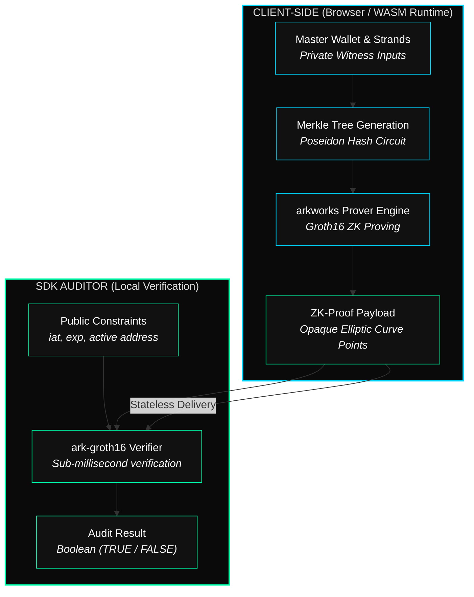
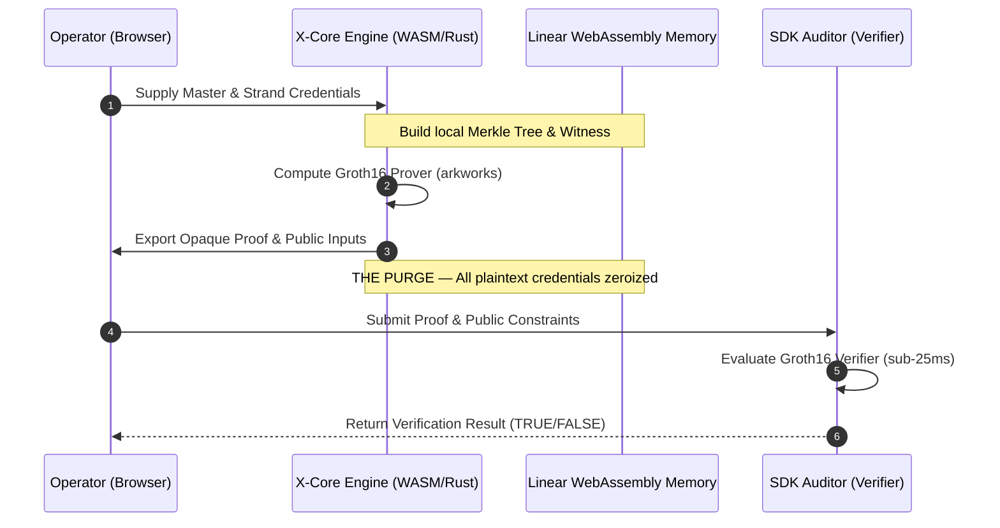

# IdentiFI Protocol

### The Stateless Cryptographic Engine for Zero-Knowledge Possession Validation

[](https://www.rust-lang.org/)
[](https://webassembly.org/)
[](https://arkworks.rs/)
[](https://ethereum.org/en/developers/)

> **"IT'S NOT A WALLET — IT'S A SIGNAL OF POWER."**

---

## Table of Contents

- [Abstract](#abstract)
- [The Problem](#the-problem)
- [The SKINWALKER Paradigm](#the-skinwalker-paradigm)
- [Core ZK-Engine Architecture](#core-zk-engine-architecture)
- [Execution Flow](#execution-flow)
- [SDK & Auditor Integration](#sdk--auditor-integration)
- [Performance Benchmarks](#performance-benchmarks)
- [Security & Memory Model](#security--memory-model)
- [System Requirements](#system-requirements)
- [License & Intellectual Property](#license--intellectual-property)

---

## Abstract

**IdentiFI** is a **Stateless Possession Validation Protocol** — a sovereign cryptographic engine that enables operators to prove unified control over a cluster of EVM wallets without exposing private keys, linking addresses on public blockchain explorers, or relying on any centralized database.

The protocol operates entirely in volatile memory via client-side WebAssembly (compiled from native Rust). Every session terminates with a full cryptographic purge. What remains is only the mathematical proof of authorized cluster membership — nothing else.

By utilizing a high-performance **Groth16 ZK-SNARK circuit** powered by the **arkworks** ecosystem, IdentiFI removes the need for centralized identity providers, off-chain registries, or on-chain linkages. Verification is instant, private, and local.

---

## The Problem

Existing identity and wallet association models in Web3 operate under a fundamental security vulnerability:

| Constraint | Status Quo | IdentiFI Resolution |
|:--|:--|:--|
| **Multi-Wallet Ownership** | Public on-chain transactions or centralized databases link clusters | Zero public linkage. Cluster membership proven via ZK-SNARKs |
| **Session Persistence** | Persistent cookies, local storage, or JWTs expose wallet graphs | Volatile memory only. Irreversible purge upon session exit |
| **Authority Verification** | Trust-based or server-dependent validation | Client-side, locally forged zero-knowledge proofs |
| **Data Sovereignty** | Custodial indexing makes investors public targets | Selective transparency. The operator holds the only keys to disclosure |

IdentiFI does not bridge or log identities. It proves possession mathematically and vanishes.

---

## The SKINWALKER Paradigm

The core design philosophy of IdentiFI is the **SKINWALKER Protocol**: the absolute separation of **asset ownership** from the **operator's active identity**.

* **Dynamic Identity Rotation:** The user binds a master wallet to a set of sub-wallets (*Strands*). The operator can execute actions using any sub-wallet, proving they belong to an authorized cluster without exposing the master wallet or any sister wallet.
* **Immediate Immunity (The Reset):** If a sub-wallet is monitored or compromised, the user simply transfers funds, rotates keys locally, and generates a new cryptographic signal. The previous link is instantly severed, leaving zero historical trace of association.
* **Selective Transparency:** Visualizations and data linkages remain in the possession of the operator. Third parties and auditors only receive a binary validation output: `TRUE` or `FALSE`.

---

## Core ZK-Engine Architecture

The engine shifts validation from legacy symmetric obfuscation to local zero-knowledge mathematical constraints.



### Circuit Constraint Schema

The cryptographic circuit enforces validation by dividing parameters strictly into private witnesses and public variables:

* **Private Inputs (Witnesses):**
  - Master Wallet Address ($m$)
  - List of bound Strand Addresses ($c_1, c_2, ..., c_n$)
  - Elliptic curve signatures validating co-ownership of the cluster nodes
* **Public Inputs (Exposed Variables):**
  - Current Active Transaction Address ($a$)
  - Issuance Timestamp ($iat$)
  - Expiry Timestamp ($exp$)
  - Merkle Root of the Cluster ($R$)

---

## Execution Flow

The end-to-end local lifecycle of a zero-knowledge possession proof:



> **The Purge Principle:** Immediately following proof generation, the WASM memory space executes aggressive clearing routines (`zeroize`). Buffers, temporary signatures, and plaintext wallet addresses are irreversibly wiped using unsafe Rust operations to prevent V8 engine memory dumps.

---

## SDK & Auditor Integration

The IdentiFI SDK is designed to run natively in TypeScript environments, serving as a wrapper around the compiled WASM binary.

### Key API Layout

- **Prover Interface:**
  - `generate_possession_proof(private_inputs, public_inputs) -> Promise<ZkProofPayload>`
  - Executes local Merkle tree structuring, Poseidon hashing, and Groth16 proving.
- **Auditor Interface:**
  - `verify_possession_proof(proof, public_inputs) -> boolean`
  - Validates that the mathematical proof matches the public parameters and the commitment root.

---

## Performance Benchmarks

Execution performance measured on client-side environments (running the native WASM engine locally):

```bash
1. Generating Merkle Tree (local)...
   Merkle root: 0x0b015d3771810ae636b73f3e9d77e062cc92ffb881666aaf68fffffce596bc81
   -> Merkle Tree Compute: 98.133ms

2. Generating ZK Proof (Client-side WASM)...
   Proof cryptographically computed successfully!
   -> Prover Execution (Groth16): 7.082s

3. Auditing Proof Verification (SDK Verifier)...
   ✅ SUCCESS: Proof 100% Valid in the Groth16 Circuit!
   -> Verification Time: 22.177ms

------------------------------------
Total cycle time: 7.228s
```

---

## Security & Memory Model

IdentiFI's security guarantees are enforced at the architectural level:

* **Sandbox Isolation:** The Rust engine compiles to a standard WebAssembly target, executing strictly within the browser's WASM sandbox. It has zero DOM access and makes no network calls.
* **Cryptographic Commitment:** No raw wallet lists are exported. The outer environment only sees the Merkle root ($R$) and the cryptographic proof.
* **Prover-Verifier Asymmetry:** Proving is computationally intensive (~7s client-side) to secure the witness. Verification is lightweight (~22ms), allowing seamless integration into high-throughput SDK auditing clients.

---

## System Requirements

| Tool | Minimum Version | Purpose |
|:--|:--|:--|
| **Node.js** | 18+ | SDK execution and test orchestration |
| **Rust** | 1.75+ | ZK circuit compilation |
| **wasm-pack** | Latest | WebAssembly generation |

---

## License & Intellectual Property

IdentiFI Protocol is **proprietary software**. All source code, compiled WASM binaries, cryptographic circuits, and architectural blueprints are the exclusive property of the IdentiFI engineering team.

- **Source Code:** Unauthorized redistribution, modification, or copying is strictly prohibited.
- **WASM Binaries:** Sealed execution units. Reverse engineering or binary decompilation is prohibited.

---

<p align="center">
  <br/>
  <strong>IdentiFI Protocol</strong><br/>
  <em>The Stateless ZK-Engine for Possession Validation</em><br/>
  <br/>
  <code>Status: OPERATIONAL</code>&nbsp;&nbsp;|&nbsp;&nbsp;<code>Engine: ZK-Core (Rust/WASM)</code>&nbsp;&nbsp;|&nbsp;&nbsp;<code>Compliance: 100% Stateless</code>
  <br/><br/>
  © 2026 IdentiFI Protocol — All Rights Reserved.
</p>
